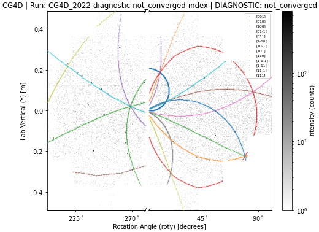

# Joint count-based solve (draft)

`solve` is the sole CLI entry point for the experimental count-based indexing
and detector calibration workflow. `calibrate` and `spherical-index` are
removed from the CLI, with no aliases. Their numerical Python runners remain
available for regression comparisons; `solve` does not call them or the finder.
The conventional finder/indexer/integrator workflow is unaffected.

```bash
python -m subhkl.io.parser solve pooled.h5 solution.h5 \
  --metadata setting.h5 --d-min 3.2 --penalty 1.2
```

The input contains `images` shaped `(frames, rows, columns)` and one `bank_ids`
entry per image. A still, repeated exposures, or a rotation scan can be supplied.
`file_offsets` and `files` retain run boundaries and labels. Each setting gets
its own reflection intensities and panel background scales; orientations in
sample coordinates and detector corrections are shared. Raw images and explicit
background priors are read one setting at a time. Do not sum images recorded at
different angles.

Instrument, cell, space group and wavelength metadata can live in the counts
file or `--metadata`. Goniometer rotations are frame-addressed `goniometer/R`
(one matrix may be broadcast for a still). When R is absent, the solver computes
it from `goniometer/axes` and frame-addressed `goniometer/angles`, including
stored global offsets. Without either representation, sample coordinates are
defined as lab coordinates. Non-+z beams and curved panels remain unsupported.

Input `goniometer/per_run` corrections are honored. Unfolded `delta_deg` or
`delta_deg_all_axes` is applied using `frame_to_run` (or `file_offsets`), while
canonical corrected angles with `angles_nominal` are not corrected twice.
`goniometer/translations` can be a sample-frame vector or one lever arm per axis;
`per_run/trans_m` is an additional sample-frame displacement. The forward model
uses the resulting lab sample origin, separately from detector placement.
Outputs preserve corrected angles, offsets, run maps, translations and absolute
detector geometry in the existing consumer layout. These goniometer corrections
are currently **read and held fixed**, not newly refined by `solve`.

## What is unified

The global lattice ladder receives spatial sums of all valid signed count
residuals. It proposes distinct orientations, quotienting by lattice
symmetries that preserve the allowed reflection set. One nonnegative Poisson
group-sparse fit then estimates reflection intensities and panel background
scales. A local outer refinement profiles that same objective over orientations
and shared detector geometry. Stills use six parameters (radial scale, two
tilts, three translations); scans free detector roll about the beam as a seventh
parameter when relative setting rotations do not commute with beam-axis rotation.
Joint proposals rotate scattering-vector directions into the sample frame while
retaining the lab scattering angles for wavelength consistency.
The group weights are frozen at the starting geometry of the fit/refinement.

The proposal score is an acceleration mechanism, not the likelihood itself.
Proposals can miss an orientation; `--n-candidates` is a maximum, not a promise
of that many distinct basins or an exhaustive multi-crystal search. The
regularization `--penalty` selects orientation groups, never individual observed
spot locations. Nearby groups can still represent one mismodeled crystal.
The default value is experimental, not calibrated false-alarm control over SO(3).

`--fixed-geometry` holds the instrument geometry fixed while fitting orientation
and intensities. `--no-refine` performs only the sparse intensity/background fit
on the proposed or supplied orientation dictionary. Neither option invokes the
retired calibration/indexing objectives.

## Background and shape priors

The default background shape is a local median of all valid count bins, with
a free scale per panel. This simple model is inadequate for some real static
structures. `--background-file background.h5` supplies positive expected counts
per original pixel in `images`, with `bank_ids` aligned by ID; its panel scales
are still fitted. `--static-mask-file` carries instrument validity, and partially
masked proposal bins retain their valid counts with their mean valid location.

The default reflection footprint is a pixel-integrated Gaussian, with
`--sigma-px` in original detector pixels. An informed non-Gaussian shape can be
supplied using `--profile-file prior.h5`, containing:

| Dataset | Meaning |
|---|---|
| `profile/u` | Increasing nonnegative radius in model sigma units |
| `profile/f` | Finite nonnegative radial shape at those radii |

The forward model integrates that prior over count bins and normalizes it on
the entire unmasked plane. Cropping and masks do not renormalize reflection
flux. The shape is persisted in the result so it can be reused.

The routines formerly in `search/matrix_free.py` are now public, shared APIs:

```python
from subhkl.search.profiles import (
    measure_radial_profile,
    measure_whitened_profile,
    RadialProfile,
)
```

Finder/integrator call those same implementations through their existing local
names. Both measurements qualify bright windows and may return `None` when
there is insufficient information. Those rules estimate a family prior; they
are **not** called automatically by `solve` and never gate its count bins.
For example, a profile measured from a separate reference exposure can be saved
and supplied without introducing a peak-detection stage into indexing:

```python
shape = measure_radial_profile(reference_images, reference_background,
                               bg_hi=background_level, max_sigma=6.0)
if shape is not None:
    with h5py.File("prior.h5", "w") as out:
        out["profile/u"], out["profile/f"] = shape
```

## Output and restart

`solution.h5` contains the usual cell, reciprocal matrix `sample/B`, wavelength
band, and absolute `detector_calibration/bank_*` geometry. That geometry is
loaded as a fresh baseline when restarting with `--bootstrap solution.h5`;
global instrument configuration is not mutated and corrections are not doubled.
A supplied metadata file's detector calibration is also honored.

| Dataset/group | Meaning |
|---|---|
| `solve/orientations_lab`, `solve/orientations_sample` | Lab orientations `(settings,N,3,3)` for scans, `(N,3,3)` for a still; sample orientations always `(N,3,3)` |
| `solve/frame_to_setting`, `solve/frame_to_run`, `solve/sample_origin_lab` | Frame-addressed setting/run maps and sample origins |
| `solve/reflection_setting`, `solve/hkl` | Setting and hkl identity of each intensity column |
| `solve/geometry_parameter_names` | Explicit six- or seven-parameter ordering |
| `solve/active`, `solve/group_norms`, `solve/group_weights` | Sparse support and its normalization |
| `solve/intensities`, `solve/hkl` | Physical reflection flux estimates and column identities |
| `solve/g`, `solve/background_scales` | Shared geometry increment and background scales |
| `solve/objective_*`, `solve/stationarity_residual`, `solve/stationarity_tolerance` | Fit diagnostics and the actual stopping threshold |
| `solve` attributes | Status, model settings and source provenance |
| `sample/U` | Primary active orientation, only for a converged nonempty solution |

The existing predictor consumes the primary `sample/U`. Multiple components
are saved in `solve/` and announced; exporting every component is future work.
These are group-sparse, shrunken intensity estimates, not final integrated
intensities for merging. The output is written atomically. An unconverged intensity fit, outer refinement, or a fitted
empty support produces a diagnostic result without `sample/U` and a nonzero
CLI exit status. This includes failure of the initial intensity fit, so its
proposals remain inspectable. Invalid inputs and absent proposal evidence
stop before replacing the output. Input files cannot
be overwritten by the output.

Stationarity is checked at the accepted coefficients with a unit proximal
step, independent of the line-search step. The threshold is `atol + rtol *
max(1, largest group penalty)` in Fisher-normalized coefficient units;
`solve` uses `rtol=1e-6`, with `atol=1e-5` initially and `2e-5` during refinement.
Support-constrained L-BFGS and small reduced Newton systems polish difficult
fits, followed by the full stationarity check, including inactive groups.
Background-only pixels are summed by panel as exact sufficient statistics;
the reported objective and predicted mean retain the original pixel likelihood.

For an explicit dictionary, `--bootstrap candidates.h5` can read an
`orientations` dataset `(N,3,3)` in lab coordinates. It can also read the
`sample/U` of an existing single-crystal result, converted using the current
setting, or all `solve/orientations_lab` from a previous solve. The entire
provided dictionary is fitted; `--n-candidates` limits global proposals only.

## Migration and evidence

The actual `solve` CLI also recovers the single-crystal synthetic case from
nominal geometry without a bootstrap: **0.00943 degrees** orientation error,
**2.44599%** radial correction versus 2.50000% planted, and convergence in 510
objective evaluations. The machine-readable [CLI result](experiments/poisson-orientations/solve-cli.json)
records the fit diagnostics. The separate experiment scripts below are earlier
measurements of the numerical prototype.

Replace `calibrate pooled.h5 calibration.h5` followed by `spherical-index ...`
with one `solve pooled.h5 solution.h5 --metadata setting.h5`. There is no
one-for-one migration for the old spherical CLI's per-run/harmonic goniometer,
cell-shape, per-panel, beam, or curved-detector refinements. Those features
have not been ported to this draft model.

The [experiment report](poisson-orientations.md) records a threshold-free global
synthetic chain reaching 0.0096 degrees from nominal geometry, and a two-crystal
candidate test in which fitting geometry removes false extra orientations.
The real pooled-count objective favors a supplied calibrated geometry, but
background/profile mismatch activates unrelated candidates and strong penalties
expose boundary-solver failures. These are draft limitations, not evidence of
production-ready real-data calibration or crystal counting.

The [CG4D garnet follow-up](experiments/poisson-orientations/garnet.md) shows why
`--d-min` must suit the crystal: the 3.2 Angstrom default has only 36 allowed
reflections for this cell/space group and fails blind indexing. At 1.5 Angstrom,
the blind candidate is 0.57 degrees from the independent reference and its
intensity fit converges. This does not establish accurate joint calibration;
the coarse truth-seeded fit converges to an inadequate radial correction.

With the richer garnet dictionary, joint refinement improves the objective and
reaches a 6.30% radial correction, but the orientation drifts to 1.31 degrees
from the reference and the outer evaluation budget is exhausted. The result
remains diagnostic, not a validated calibration.

An [experimental multi-setting comparison](experiments/poisson-orientations/garnet-multi-setting.md)
reduces garnet orientation error from 0.91 degrees with one setting to 0.46
with five, and lowers the conditional objective on unused settings by 26.7%.
It uses a shared sample orientation/geometry and per-setting intensities.
The original experiment held detector roll fixed for a controlled comparison;
the scan-aware CLI now enables it when identifiable.


## Finder-free visual acceptance

```bash
python -m subhkl.io.parser indexer-visualize solution.h5 \
  --images merged.h5 --output-dir overlays
```

No peaks table is required for `solve` output. The overlay uses its own calibrated
panels, per-frame rotations and sample origins, draws all active orientations,
and renders each setting separately. `--image-index` selects one frame. If
`--images` is omitted, the recorded counts source is used when available.
Unconverged or empty-support results can be inspected as candidate diagnostics:
plots and filenames explicitly carry `DIAGNOSTIC` and the solver status. This
does not create `sample/U` or promote an unsuccessful fit to a usable solution.

On the real 21-setting garnet stack (1114 panel frames), the CLI accepted the
scan and wrote full frame-addressed diagnostics. The seeded no-refinement probe
at d_min 1.5, binning 16 still failed its initial intensity stopping test
(residual 2.20e-4); this is not a successful full-scan calibration. All 21
finder-free overlays rendered with the failure status visible.

[Scan/visualizer diagnostics](experiments/poisson-orientations/garnet-scan-io.json)
and one of the 21 generated overlays (explicitly an unconverged diagnostic):


